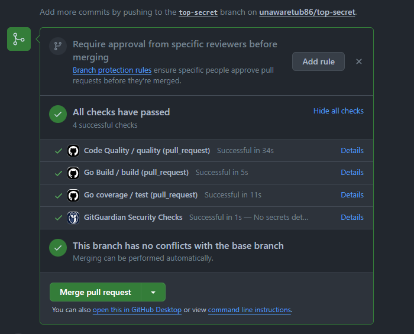

# TOP-SECRET
Go rest para obtener la ubicación de una nave y el mensaje que esta emite

<!-- TABLE OF CONTENTS -->

  
Tabla de contenidos

  <ol>
    <li>
      <a href="#sobre-el-proyecto">Sobre el proyecto</a>
      <ul>
        <li><a href="#hecho-con">Hecho con</a></li>
      </ul>
    </li>
    <li><a href="#uso">Usage</a></li>
    <li><a href="#contacto">Contacto</a></li>
  </ol>

<!-- ABOUT THE PROJECT -->
## Sobre el proyecto

Este proyecto se ha desarrollado en el contexto de la prueba técnica Fuego de Quasar. En esta prueba, se presenta un servicio FaaS (Function as a Service) que utiliza una función Lambda serverless implementada en Golang. Esta implementación se basa en una arquitectura hexagonal, que proporciona una escalabilidad más sencilla y reduce las preocupaciones relacionadas con la gestión de servidores.

El propósito de este servicio es calcular la posición de un satélite y el mensaje que debe ser descifrado. Esto se logra una vez que se han recibido las señales de todos los satélites necesarios para llevar a cabo el cálculo. El servicio se encarga de procesar los datos de entrada y proporcionar la información necesaria para cumplir con los requisitos del desafío de Fuego de Quasar.

Este servicio utiliza una arquitectura hexagonal diseñada para preservar la integridad de la lógica de negocio y permitir la incorporación de nuevas implementaciones a través de adaptadores, sin necesidad de modificar la lógica existente. Esta estructura proporciona flexibilidad para extender y adaptar el servicio a futuras necesidades, garantizando la coherencia de la aplicación.

En este servicio, hemos incorporado flujos de trabajo de GitHub Actions para asegurar la alta calidad de integración de Git Flow a través de pull requests. Estos flujos de trabajo incluyen acciones como construcción (build), cobertura superior al 80% (coverage) y verificación de código (lint). Esta implementación garantiza una integración fluida y una revisión exhaustiva del código, lo que nos permite mantener altos estándares de calidad en nuestro proyecto.

(<a href="#readme-top">Volver al inicio</a>)

### Hecho con

* [![Go][Go.dev]][Go-url]
* [![Aws][aws.com]][Aws-url]
* [![Github][github.com]][Github-url]
* [![Github Actions][github-actions.com]][GithubActions-url]

(<a href="#readme-top">Volver al inicio</a>)

<!-- USAGE EXAMPLES -->
## Uso

* [Top Secret](docs/topsecret.md) : `POST /topsecret`

(<a href="#readme-top">Volver al inicio</a>)

<!-- CONTACT -->
## Contacto

Esteban Gomez - [LinkedIn](https://www.linkedin.com/public-profile/settings?lipi=urn%3Ali%3Apage%3Ad_flagship3_profile_self_edit_contact-info%3BSnAu1%2F2AQQiK8pzcnqrLUA%3D%3D) - goal.esteban10@gmail.com

Project Link: [Github repo](https://github.com/unawaretub86/top-secret)

(<a href="#readme-top">Volver al inicio</a>)

<!-- MARKDOWN LINKS & IMAGES -->
<!-- https://www.markdownguide.org/basic-syntax/#reference-style-links -->
[linkedin-shield]: https://img.shields.io/badge/-LinkedIn-black.svg?style=for-the-badge&logo=linkedin&colorB=555
[linkedin-url]: https://linkedin.com/in/othneildrew
[Go.dev]: https://img.shields.io/badge/go-%2300ADD8.svg?style=for-the-badge&logo=go&logoColor=white
[Go-url]: https://go.dev/
[aws.com]: https://img.shields.io/badge/AWS-%23FF9900.svg?style=for-the-badge&logo=amazon-aws&logoColor=white
[Aws-url]: https://aws.amazon.com/es/
[github.com]: https://img.shields.io/badge/github-%23121011.svg?style=for-the-badge&logo=github&logoColor=white
[Github-url]: https://github.com/
[github-actions.com]: https://img.shields.io/badge/github%20actions-%232671E5.svg?style=for-the-badge&logo=githubactions&logoColor=white
[GithubActions-url]: https://github.com/features/actions
