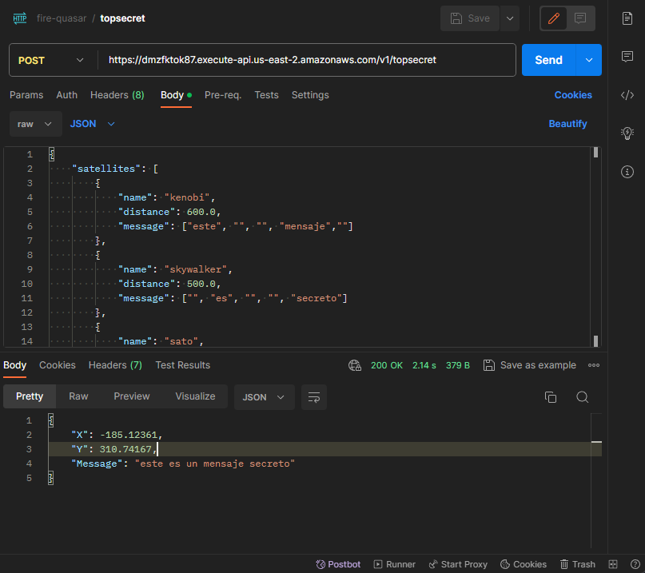
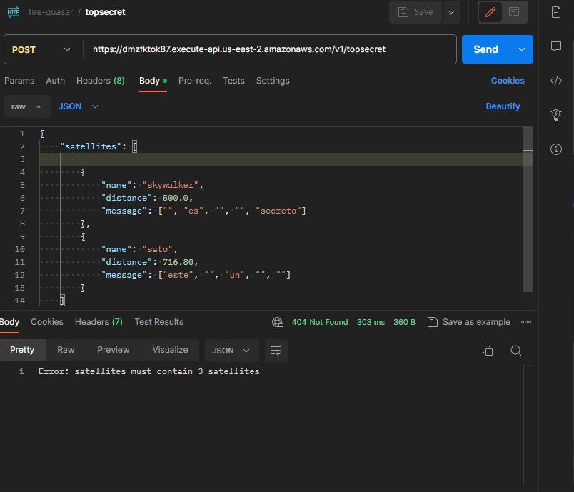

# TOP-SECRET

Para este servicio necesitaremos 3 satellites

# Solicitud de prueba

```
curl --location 'https://dmzfktok87.execute-api.us-east-2.amazonaws.com/v1/topsecret' \
--header 'Content-Type: application/json' \
--data '{
    "satellites": [
        {
            "name": "kenobi",
            "distance": 600.0,
            "message": ["este", "", "", "mensaje",""]
        },
        {
            "name": "skywalker",
            "distance": 500.0,
            "message": ["", "es", "", "", "secreto"]
        },
        {
            "name": "sato",
            "distance": 716.80,
            "message": ["este", "", "un", "", ""]
        }
    ]
}'

```

# Respuesta 200 ok



```

{
    "X": -185.12361,
    "Y": 310.74167,
    "Message": "este es un mensaje secreto"
}

```

# Respuesta 404 Error en solicitud

```
curl --location 'https://dmzfktok87.execute-api.us-east-2.amazonaws.com/v1/topsecret' \
--header 'Content-Type: application/json' \
--data '{
    "satellites": [
       
        {
            "name": "skywalker",
            "distance": 500.0,
            "message": ["", "es", "", "", "secreto"]
        },
        {
            "name": "sato",
            "distance": 716.80,
            "message": ["este", "", "un", "", ""]
        }
    ]
}'
```



```
Error: satellites must contain 3 satellites

```